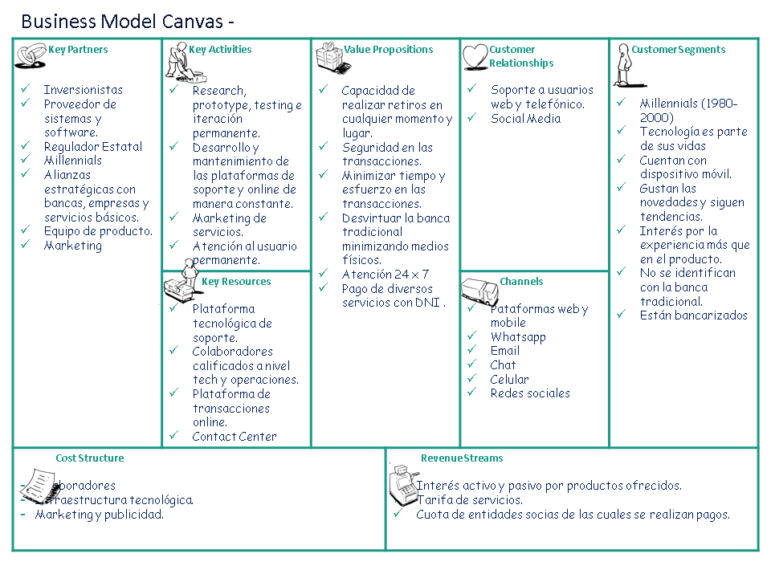
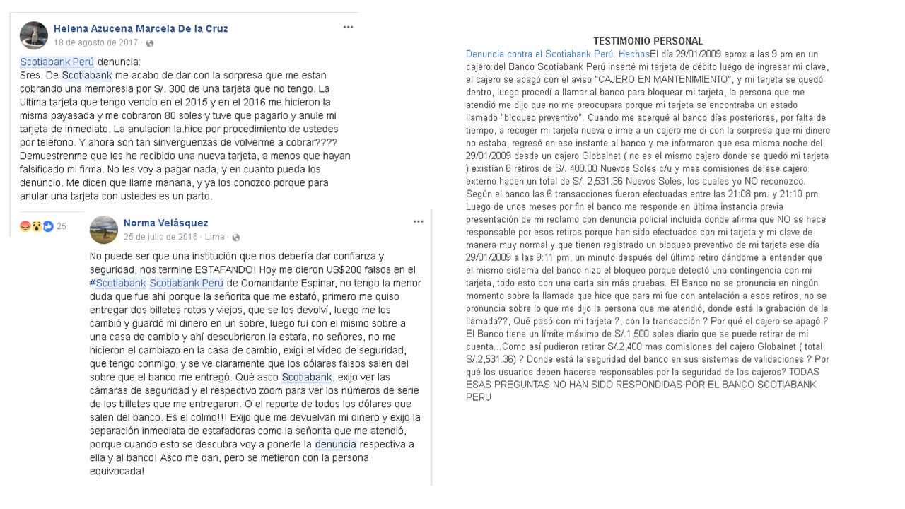

# Millennial Bank
-------------------
## Tabla de contenido
- [Idea de Negocio](#idea-de-negocio)
- [Público objetivo](#público-objetivo)

- [Stakeholders del proyecto](#stakeholders-del-proyecto)

- [Pautas para el KICK OFF MEETING](#pautas-para-el-kick-off-meeting)

- [Business Model Canvas](#business-model-canvas)

- [Propuesta de investigación](#propuesta-de-investigación)

- [Trello de organización](#trello-de-organización)
- [Equipo de trabajo](#equipo-de-trabajo)

## Idea de Negocio:

### Banca 100% digital.
- Manejar diferentes productos financieros  de diferentes entidades en un solo portal.
-  Capacidad de realizar transferencias interbancarias con rapidez entre entidades asociadas al app.
- Transparencia y autenticidad sobre su cuenta
corriente, cuáles son sus gastos, cuáles son los costos de sus productos,
qué productos poseen actualmente y por cuánto tiempo. 
- Constante comunicación respecto a fechas y obligaciones de pago.

## Público objetivo:

•	Millenials.
    
### ¿Cuál es su perfil? ####

Personas de 18 a 34 años.

- Financieramente suelen gastar mucho, ya que están enfocados en su bienestar y no tienen arraigada la cultura del ahorro.

- Se endeudan fácilmente y para ellos es complicado conseguir dinero para cuotas iniciales.

- Son consumidores exigentes a la hora de elegir un producto y clientes demandantes al momento de evaluar un servicio.

- Más de la mitad de millennials no tienen nada ahorrado. (Encuesta de Go Banking Rates - 2017)

La siguiente infografía nos da más alcances sobre su comportamiento...

### ¿Qué piensan los millennials de los bancos? ####

- El 40% de los millennials nunca ha pisado una sucursal bancaria y  la mayoría no está familiarizado con las funciones que cumplen las instituciones financieras, pues muchos ven ajenos conceptos como tasas, intereses y créditos. (https://gestion.pe/economia/empresas/millennials-nuevo-dolor-cabeza-banca-137027)

- El 53% de los encuestados no piensa que su banco sea diferente al de los demás, por lo que uno de cada tres estaría dispuesto a cambiar de entidad fácilmente.(https://gestion.pe/economia/empresas/millennials-nuevo-dolor-cabeza-banca-137027)  

- 71% Prefiere ir al dentista que ir a su banco.
- 33% Cree que no necesitan un banco.
-  73% Estaría interesado en una oferta bancaria
de Google o Amazon.
- 23% Cita que la falta de un app móvil es razón suficiente para no interactuar con un banco. 

Fuente (http://www.fisagrp.com/pdf/fisa-millenial-report.pdf)

## **Stakeholders del proyecto**

### Grupo de interés:

•	_CEO:_ Mayor responsabilidad directa en el banco.

•	_Product Owner:_ Responsable de maximizar el valor del producto y el trabajo del Equipo de Desarrollo.

•	_Product Manager:_ Identifica oportunidades, tendencias, problemas, segmentos nuevos en el mercado, con el objetivo de desarrollar y proporcionar un producto de éxito y rentable para el banco.

•	_Project Manager:_ Facilitador en el proceso de desarrollo del producto.

•	Community Manager: Desarrolla la comunidad online de la marca y es responsable de detectar a los potenciales clientes.

•	_Gerente de Marketing:_ Traza estrategias para llegar al público objetivo. 

•	_Gerente de Riesgos:_ Identifica los riesgos que podrían acechar al banco y diseña estrategias frente a ellos.

•	_Jefe de innovación:_ Remueve obstáculos que impiden la ejecución de un proyecto de innovación (aliado estratégico).

•	_Visual designers y Front-end developers:_ Involucrados en el desarrollo del producto en todas sus etapas. 

## **Pautas para el KICK OFF MEETING**

__Invitados:__ La parte involucrada (skateholders).

Priorizar entrevistas One-to-one, para que no haya sesgos y no se vean influenciadas las opiniones. 
En caso de haber dos grupos con ideas distintas hacer un grupal meeting.

***Duración estimada:*** 30 min a 1 hra máximo.

### **Focus questions:**

1.	¿Qué actividades realizarán los usuarios con el producto que son importantes para el éxito del negocio? (Product Manager)

2.	¿Cuál es el principal problema del negocio que se espera resolver con el producto? (Product Manager, Gerente de riesgos)

3.	¿Cuál es tú visión del producto? (CEO, Product Owner)

4.	¿Qué es lo que se espera lograr en la primera versión del producto? (Project Manager, Product Manager)

5.	¿Cuándo se prevé que sea el lanzamiento del producto? (Project Manager, Product Manager)

6.	¿Qué necesitamos que ocurra para que nuestro producto sea considerado un éxito? (Gerente de marketing, Jefe de innovación)

7.	¿Cómo sabremos cuándo ya sea un éxito? (Product Manager, Community Manager, Gerente de marketing)

8.	¿Cómo el producto proveerá valor / ganancias a la organización? (Product Owner, Product Manager)

9.	¿Cuáles son los objetivos a corto y mediano plazo del producto? (Project Manager, Product Manager)

10.	 ¿Qué les preocupa acerca del producto? (CEO, Product Owner, Product Manager)

11.	 ¿Con qué frecuencia el usuario promedio utiliza nuestro producto (diariamente, semanalmente, etc)? (Product Manager, Community Manager)

12.	 ¿El público utiliza otros productos para llegar a las mismas metas? Si es así, ¿cuáles son? (Community Manager, Gerente de Riesgos)

13.	 Si fueras a categorizar a los usuarios, ¿qué etiquetas usarías? (Product manager, Community Manager)

14.	 ¿Podríamos dar descripciones de las personas usando el producto? (General).

### **Plan de presentación para el KICK-OFF**

Son los puntos a tratar dentro de la agenda.

1.	Objetivo y alcances del proyecto

2.	Beneficios del proyecto

3.	Hitos del proyecto

    Calendarización de entregables.

4.	Identificación de riesgos

5.	Entrega del acta de compromiso

    Confirmar roles y responsabilidades de los participantes.

6.	Agendar reuniones de seguimiento.

## **Business Model Canvas**

## **Propuesta de investigación**

### **Objetivos de investigación**
1. Conocer los gustos y preferencias de los millennials respecto a la banca tradicional y su comportamiento en el medio digital.

### **Técnicas a emplear**

1. Benchmark con las apps sugeridas (Nequi, Nubank, Simple)
- Navegaremos en los principales canales virtuales que poseen las diversas entidades financieras para conocer su contexto digital. 

2. Data Analytics
- Navegaremos en los principales canales virtuales que poseen las diversas entidades financieras para conocer su contexto digital y la percepción de sus clientes. 

3. Encuestas presenciales y online.
- Se realizaran encuestas presenciales y online a los usuarios y potenciales usuarios que conformen nuestro target para conocer de primera mano la experiencia que poseen.

4. Entrevistas a expertos.
- Se entrevistará a los principales stakeholders involucrados en el kick off y personas involucradas en el mundo bancario.

5. Observación participativa.
- Se realizará la interacción con las diferentes apps financieras para realizar benchmarking.

## **Trello de organización**

https://trello.com/b/mt8tCKZQ/millenial-bank

## **Descubrimiento e investigación**

### **Benchmark con las apps sugeridas (Nequi, Nubank, Simple)**

### **Data Analytics**
#### **Banco de Crédito del Perú - BCP** YAS
##### **Opiniones de los usuarios**
##### **Sobre su app/web**

#### **Banco Continental - BBVA** YAS
##### **Opiniones de los usuarios**
##### **Sobre su app/web**

#### **Interbank** YAS
##### **Opiniones de los usuarios**
##### **Sobre su app/web**

#### **Scotiabank**
##### **Opiniones de los usuarios**

##### **Sobre su app/web**

#### **Mibanco**
##### **Opiniones de los usuarios**

#### **Inferencias**

### **Encuestas presenciales y online**
#### **Encuesta presencial** (ADA)
##### **Cuestionario**
##### **Gráficos**
#### **Encuesta online** (YAS)
##### **Cuestionario**
##### **Resultados**
#### **Inferencias** (ADA)
### **Entrevistas a expertos - Principales insights** (ADA)

#### **Ayrton Checa Ruiz (Asistente de Operaciones - BCP)**

#### **Leonardo Ballon Urbano (Analista de Inteligencia Comercial - Banco Financiero del Perú)**

#### **Anggel Carlos Usaqui (Cajera - BBVA)**

### **Observación participativa** 
- Evaluar la interaccion de las principales operaciones que salgan de las encuestas.

## **Síntesis y definición**
### **Affinity Mapping** YAS
- Para encontrar los principales procesos que se realizan y los principales motivos de insatisfaccion de la banca tradicional

#### **Temas encontrados**
- a
- b
- c

### **User persona** 

#### **User persona primary** ADA
#### **User persona secondary** YAS

### **CUSTOMER JOURNEY MAP - PROCESOS CRITICOS** YAS
- A
- B
- C

### **Problem Statements** YAS

## **Ideación** 
### **Feature list** ADA

## **Equipo de trabajo**
- [Ada Yajahuanca](https://github.com/adayc) 
- [Yasmin Mattos](https://github.com/YasminMattos)

