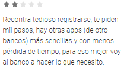
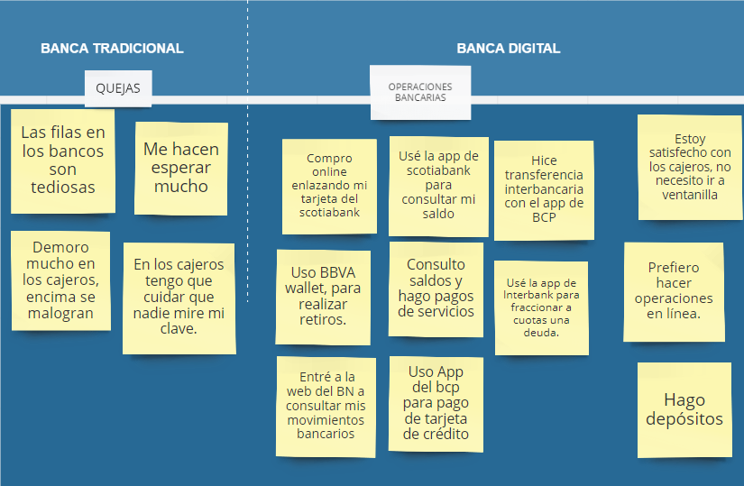

# Millennial Bank
-------------------
## Tabla de contenido
- [Idea de Negocio](#idea-de-negocio)
- [Público objetivo](#público-objetivo)

- [Stakeholders del proyecto](#stakeholders-del-proyecto)

- [Pautas para el KICK OFF MEETING](#pautas-para-el-kick-off-meeting)

- [Business Model Canvas](#business-model-canvas)

- [Propuesta de investigación](#propuesta-de-investigación)

- [Trello de organización](#trello-de-organización)
- [Equipo de trabajo](#equipo-de-trabajo)

## Idea de Negocio:

### Banca 100% digital.
- Manejar diferentes productos financieros  de diferentes entidades en un solo portal.
-  Capacidad de realizar transferencias interbancarias con rapidez entre entidades asociadas al app.
- Transparencia y autenticidad sobre su cuenta
corriente, cuáles son sus gastos, cuáles son los costos de sus productos,
qué productos poseen actualmente y por cuánto tiempo. 
- Constante comunicación respecto a fechas y obligaciones de pago.

## Público objetivo:

•	Millenials.
    
### ¿Cuál es su perfil? ####

Personas de 18 a 34 años.

- Financieramente suelen gastar mucho, ya que están enfocados en su bienestar y no tienen arraigada la cultura del ahorro.

- Se endeudan fácilmente y para ellos es complicado conseguir dinero para cuotas iniciales.

- Son consumidores exigentes a la hora de elegir un producto y clientes demandantes al momento de evaluar un servicio.

- Más de la mitad de millennials no tienen nada ahorrado. (Encuesta de Go Banking Rates - 2017)

La siguiente infografía nos da más alcances sobre su comportamiento...

### ¿Qué piensan los millennials de los bancos? ####

- El 40% de los millennials nunca ha pisado una sucursal bancaria y  la mayoría no está familiarizado con las funciones que cumplen las instituciones financieras, pues muchos ven ajenos conceptos como tasas, intereses y créditos. (https://gestion.pe/economia/empresas/millennials-nuevo-dolor-cabeza-banca-137027)

- El 53% de los encuestados no piensa que su banco sea diferente al de los demás, por lo que uno de cada tres estaría dispuesto a cambiar de entidad fácilmente.(https://gestion.pe/economia/empresas/millennials-nuevo-dolor-cabeza-banca-137027)  

- 71% Prefiere ir al dentista que ir a su banco.
- 33% Cree que no necesitan un banco.
-  73% Estaría interesado en una oferta bancaria
de Google o Amazon.
- 23% Cita que la falta de un app móvil es razón suficiente para no interactuar con un banco. 

Fuente (http://www.fisagrp.com/pdf/fisa-millenial-report.pdf)

## **Stakeholders del proyecto**

### Grupo de interés:

•	_CEO:_ Mayor responsabilidad directa en el banco.

•	_Product Owner:_ Responsable de maximizar el valor del producto y el trabajo del Equipo de Desarrollo.

•	_Product Manager:_ Identifica oportunidades, tendencias, problemas, segmentos nuevos en el mercado, con el objetivo de desarrollar y proporcionar un producto de éxito y rentable para el banco.

•	_Project Manager:_ Facilitador en el proceso de desarrollo del producto.

•	Community Manager: Desarrolla la comunidad online de la marca y es responsable de detectar a los potenciales clientes.

•	_Gerente de Marketing:_ Traza estrategias para llegar al público objetivo. 

•	_Gerente de Riesgos:_ Identifica los riesgos que podrían acechar al banco y diseña estrategias frente a ellos.

•	_Jefe de innovación:_ Remueve obstáculos que impiden la ejecución de un proyecto de innovación (aliado estratégico).

•	_Visual designers y Front-end developers:_ Involucrados en el desarrollo del producto en todas sus etapas. 

## **Pautas para el KICK OFF MEETING**

__Invitados:__ La parte involucrada (skateholders).

Priorizar entrevistas One-to-one, para que no haya sesgos y no se vean influenciadas las opiniones. 
En caso de haber dos grupos con ideas distintas hacer un grupal meeting.

***Duración estimada:*** 30 min a 1 hra máximo.

### **Focus questions:**

1.	¿Qué actividades realizarán los usuarios con el producto que son importantes para el éxito del negocio? (Product Manager)

2.	¿Cuál es el principal problema del negocio que se espera resolver con el producto? (Product Manager, Gerente de riesgos)

3.	¿Cuál es tú visión del producto? (CEO, Product Owner)

4.	¿Qué es lo que se espera lograr en la primera versión del producto? (Project Manager, Product Manager)

5.	¿Cuándo se prevé que sea el lanzamiento del producto? (Project Manager, Product Manager)

6.	¿Qué necesitamos que ocurra para que nuestro producto sea considerado un éxito? (Gerente de marketing, Jefe de innovación)

7.	¿Cómo sabremos cuándo ya sea un éxito? (Product Manager, Community Manager, Gerente de marketing)

8.	¿Cómo el producto proveerá valor / ganancias a la organización? (Product Owner, Product Manager)

9.	¿Cuáles son los objetivos a corto y mediano plazo del producto? (Project Manager, Product Manager)

10.	 ¿Qué les preocupa acerca del producto? (CEO, Product Owner, Product Manager)

11.	 ¿Con qué frecuencia el usuario promedio utiliza nuestro producto (diariamente, semanalmente, etc)? (Product Manager, Community Manager)

12.	 ¿El público utiliza otros productos para llegar a las mismas metas? Si es así, ¿cuáles son? (Community Manager, Gerente de Riesgos)

13.	 Si fueras a categorizar a los usuarios, ¿qué etiquetas usarías? (Product manager, Community Manager)

14.	 ¿Podríamos dar descripciones de las personas usando el producto? (General).

### **Plan de presentación para el KICK-OFF**

Son los puntos a tratar dentro de la agenda.

1.	Objetivo y alcances del proyecto

2.	Beneficios del proyecto

3.	Hitos del proyecto

    Calendarización de entregables.

4.	Identificación de riesgos

5.	Entrega del acta de compromiso

    Confirmar roles y responsabilidades de los participantes.

6.	Agendar reuniones de seguimiento.

## **Business Model Canvas**

## **Propuesta de investigación**

### **Objetivos de investigación**
1. Conocer los gustos y preferencias de los millennials respecto a la banca tradicional y su comportamiento en el medio digital.

### **Técnicas a emplear**

1. Benchmark con las apps sugeridas (Nequi, Nubank, Simple)
- Navegaremos en los principales canales virtuales que poseen las diversas entidades financieras para conocer su contexto digital. 

2. Data Analytics
- Navegaremos en los principales canales virtuales que poseen las diversas entidades financieras para conocer su contexto digital y la percepción de sus clientes. 

3. Encuestas presenciales y online.
- Se realizaran encuestas presenciales y online a los usuarios y potenciales usuarios que conformen nuestro target para conocer de primera mano la experiencia que poseen.

4. Entrevistas a expertos.
- Se entrevistará a los principales stakeholders involucrados en el kick off y personas involucradas en el mundo bancario.

5. Observación participativa.
- Se realizará la interacción con las diferentes apps financieras para realizar benchmarking.

## **Trello de organización**

https://trello.com/b/mt8tCKZQ/millenial-bank

## **Descubrimiento e investigación**

### **Benchmark con las apps sugeridas (Nequi, Nubank, Simple)**

### **Data Analytics**
#### **Banca Móvil BCP**

Funciones con las que cuenta:

- Consulta de saldos y movimientos de las cuentas y tarjetas de crédito

- Transferencias entre cuentas y cuentas de terceros del BCP

- Pagar las tarjetas de crédito y de terceros del BCP

- Recargar celulares Movistar

- Disponer de efectivo de las tarjetas de crédito del BCP

- Localizar canales de atención

- Acceso directo a la aplicación de Beneficios BCP.

##### **Comentarios**

#### **Banca Móvil BBVA:**

- Compartir el número de cuentas por whatsapp, por correo o redes sociales.

- Pagar recibos de servicios e instituciones

- Bloquear tu tarjeta inmediatamente

- Configurar tus tarjetas para controlar tu disposición de efectivo, compras por internet, en el exterior.

- Enviar dinero a través de Efectivo Móvil a un número propio o al de terceros

##### **Comentarios**

#### **Interbank APP**

-	Personalizar cuentas y configurar operaciones frecuentes

-	Descargar el Estado de Cuenta de tarjetas de crédito

-	Recargar celulares Movistar, Claro y Entel

-	Recibir constancias automáticas de operaciones

-	Sección de “Preguntas frecuentes” 

##### **Comentarios**

Fuente: Google Play.

#### **Scotiabank**
- Menú principal (Tus cuentas, efectivo móvil)
- Menú de transferencias
- Pagos de tarjetas y prestamos
- Recargar celulares Movistar, Claro y Entel
- Apertura de cuentas 
- Pago de servicios públicos.

##### **Comentarios**

### **Entrevistas y Encuestas a millennials**

#### **Entrevistas**
- Se realizaron entrevistas a clientes bancarizados, estas se encuentran en : https://drive.google.com/file/d/1s9-xqBa2Cxdkrxifru_pWQ-Y4vvIF6QC/view?usp=sharing

##### **Resultados**

#### **Encuestas online**

Fecha de difusión: 02/03.

Fecha de cierre: 06/03.

[Link de encuestas](https://docs.google.com/forms/d/1JHypIc86KhjpXeCSAOgIeg5RXUJeRsfqIHTITTxwKpc/edit?ts=5a9d1090#responses)

##### **Resultados**

Fueron 36 los encuestados. Millennials de 18 a 35 años, en su mayoría estudiantes del género masculino de los cuales obtuvimos los siguientes insights:

 - Posesión de tarjetas: 15 refieren tener tarjeta de crédito, mientras que 33 poseen tarjeta de débito.

 - Servicios: el 27.8% cuenta con CTS, 25% con seguros, 19.4% con AFP, solo el 4% con algún crédito hipotecario y el 47.2% no cuenta con ningún servicio adicional.

 - Principales bancos donde tiene tarjetas: BCP, BBVA, INTERBANK y SCOTIABANK.

    Siendo los mismos los preferidos por los millennials.
 
 - Principales operaciones bancarias: Depósitos, retiros y transferencias interbancarias.

 - Experiencia en banca presencial: El 58.3% refiere que ha sido buena debido a la atención y servicios brindados.

 - Posee app de bancos: BCP, BBVA, SCOTIABANK E INTERBANK.

 - Experiencia en banca digital: Solo 10 personas mencionan haber tenido una buena experiencia. 
 
 En cuanto a los problemas experimentados por las otras partes se encuentran: demora en la carga del app, deficiente UX y bugs.  

### **Entrevistas a expertos - Principales insights** (ADA)

- Se realizaron entrevistas a personas que trabajan en principales entidades bancarias con las siguientes preguntas:
- ¿Cuáles son las operaciones que realizan las personas menores a 35 años?
- ¿En qué procesos los usuarios manifiestan su incomodidad o mayor cantidad de quejas?

## **Síntesis y definición**

### **Affinity Map**

Para encontrar los principales procesos y motivos de insatisfaccion de la banca tradicional se recabaron los insights de los usuarios tanto encuestados como entrevistados:

#### **Temas encontrados**
- Quejas de la banca tradicional:

Se centra en la demora de la atención debido a las colas y a la avería de cajeros.

- Principales operaciones que realizan los millennials:

Consulta de saldo y movimientos, pago de servicios, depósitos y transferencias interbancarias.

### **User persona** 

Basándonos en nuestro target de millennials encuestados y entrevistados, se elaboró el siguiente user persona:

 

### **Customer Journey Map - PROCESOS CRÍTICOS**
- Transferencia
- Retiro
- Depósito

### **Problem Statements**

## **Ideación** 

### **Feature list**
- Consulta de saldos y movimientos en orden cronológico inverso.
- Transferencias de forma rápida bancaria e interbancaria.
- Retiro en cualquier entidad financiera asociada mediante su número de DNI.
- Pagos de servicios e instituciones (Agua, luz, teléfono, celular, Netflix, universidad, etc).
- Visualización de estados de cuenta, saldos y movimientos de otras entidades asociadas con tu DNI.
- Apertura de cuentas.
- Recarga de celulares Movistar, Claro, Entel y Bitel.
- Pago de tarjetas de crédito.
- Fraccionamiento de créditos.

### **Priorización**

- Consulta de saldos y movimientos en orden cronológico inverso. 
- Transferencias de forma rápida bancaria e interbancaria.
- Retiro en entidades financieras asociadas solo con DNI. 
- Pagos de servicios e instituciones (Agua, Luz, Telefono, Celular, Netflix, universidad, etc).
- Bloqueo y desbloqueo de tarjetas.
- Recarga de celulares Movistar, Claro, Entel y Bitel.
- Pago de tarjetas de crédito. 

## ***Testing*

### Tecnología a usar:
	
#### App Nativa / Mobile only.

Nuestro subproducto del Banco del País es una aplicación nativa, desarrollada tanto para iOS como para Android.

La elección fue hecha a raíz de que la mayoría de nuestros usuarios (millennials) usan sus dispositivos celulares todo el tiempo para estar conectados y para realizar operaciones bancarias y también porque se quiere aprovechar ciertas capacidades tanto del dispositivo como del sistema operativo, por ejemplo:

- Biometría: Opción de la huella dactilar para el _ingreso al aplicativo_, puesto que esto supone una mayor seguridad para el usuario.

- GPS: Permite el acceso a la ubicación del usuario en la opción de _Retiro express_.

## **Equipo de trabajo**
- [Ada Yajahuanca](https://github.com/adayc) 
- [Yasmin Mattos](https://github.com/YasminMattos)

